# ElevateLab Task 7 — Load Balancing & Auto Scaling on AWS (Amazon Linux)

---

## Objective

To deploy a **highly available and scalable web application** on AWS using **Elastic Load Balancer (ALB)** and **Auto Scaling Group (ASG)**.

This setup demonstrates how AWS ensures:
- **Fault tolerance** (if one instance fails, another serves traffic)
- **Scalability** (auto-adding/removing instances)
- **High availability** and **performance efficiency**

---

## Learning Outcomes

After completing this task, I learned to:

1. Deploy web applications on multiple **Amazon EC2** instances.  
2. Configure **Application Load Balancer (ALB)** to distribute incoming requests.  
3. Create **Auto Scaling Groups (ASG)** for dynamic scaling based on CPU utilization.  
4. Use **CloudWatch metrics** to monitor and trigger scaling actions.  
5. Understand **real-world cloud architecture** for high-availability applications.

---

## Tools & Resources Used

| Category | Tools / Services |
|-----------|------------------|
| **Cloud Platform** | Amazon Web Services (AWS) |
| **Operating System** | Amazon Linux 2023 |
| **Compute Service** | EC2 |
| **Load Balancer** | Elastic Load Balancer (ALB) |
| **Scaling** | Auto Scaling Group (ASG) |
| **Monitoring** | CloudWatch |
| **Security** | AWS Security Groups |
| **Web Server** | Apache HTTPD |
| **Utilities** | AWS CLI, SSH |
| **Editor / Console** | VS Code / CloudShell |
| **Browser** | Google Chrome / Edge |

---

## Step-by-Step Implementation

---

### **Step 1 — Create Security Groups**

Open EC2 → Security Groups → Create security group.

**ElevateLab-Web-SG** (for EC2 instances)

1. VPC: your VPC
2. Inbound rules:
   SSH — TCP 22 — Source: My IP
   HTTP — TCP 80 — Source: ElevateLab-ALB-SG (you can set to 0.0.0.0/0 for testing, but best use ALB SG)
4. Outbound: default (allow all)

**ElevateLab-ALB-SG** (for ALB)

4. Inbound:
  HTTP — TCP 80 — Source: 0.0.0.0/0 (ALB must accept public traffic)
5. Outbound:
  HTTP — TCP 80 — Destination: 0.0.0.0/0
  
**Screenshot:**

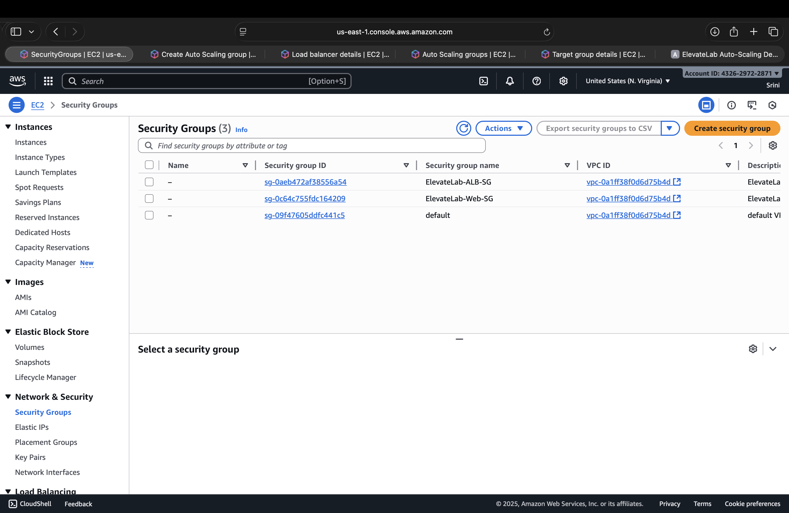

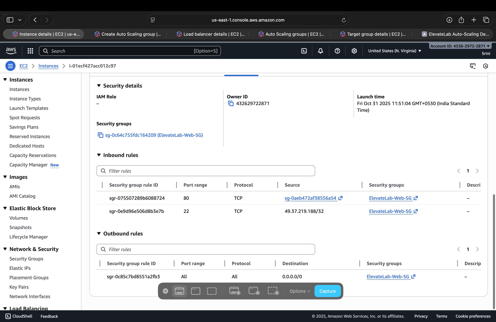

---

### **Step 2 — Launch a Base EC2 Instance**

1. Go to **EC2 → Launch Instance**
2. **Name:** `ElevateLab-Web-Server`
3. **AMI:** Amazon Linux 2023 (Free Tier)
4. **Instance Type:** `t2.micro`
5. **Key Pair:** Select your key (e.g., `elevatelab-key.pem`)
6. **Security Group:** Select `ElevateLab-Web-SG`
7. **User Data Script:**

```bash
#!/bin/bash
yum update -y
yum install -y httpd
systemctl start httpd
systemctl enable httpd

INSTANCE_ID=$(curl -s http://169.254.169.254/latest/meta-data/instance-id)
PUBLIC_IP=$(curl -s http://169.254.169.254/latest/meta-data/public-ipv4)

echo "<!DOCTYPE html>
<html>
<head><title>ElevateLab Auto Scaling Demo</title></head>
<body style='text-align:center;font-family:Arial;margin-top:80px'>
<h2>Welcome to ElevateLab Web Server</h2>
<p>Served from instance: <b>$INSTANCE_ID</b></p>
<p>Public IP: $PUBLIC_IP</p>
<p>Time: $(date -u)</p>
</body>
</html>" > /var/www/html/index.html
```
**Screenshot:**

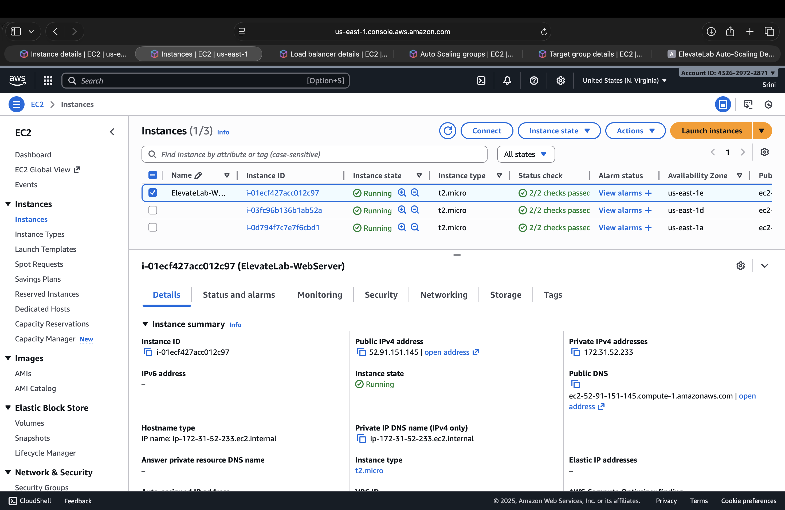

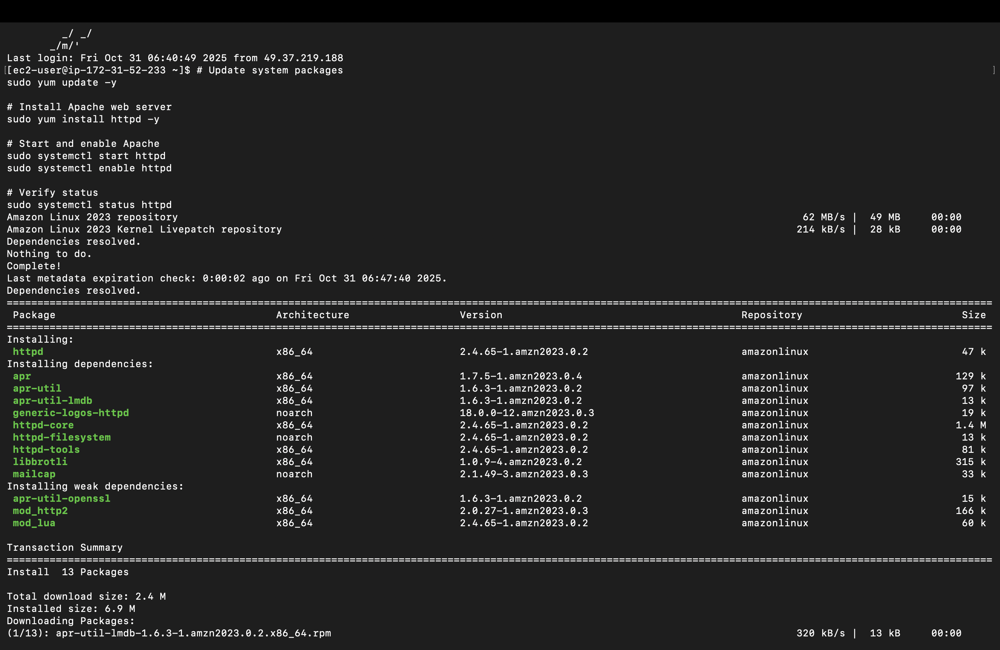

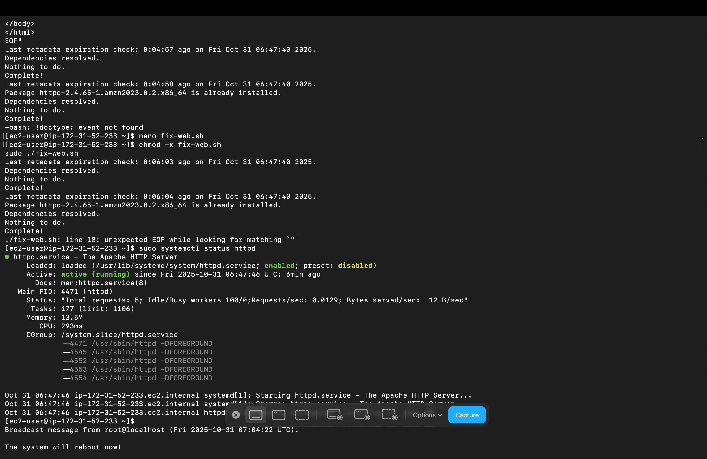


---

### **Step 3 - Create an AMI from this instance**

1. EC2 → Instances → Select ElevateLab-Web-Instance → Actions → Image and templates → Create image
2. Image name: ElevateLab-Web-AMI
3. Create image.

**Screenshot:**

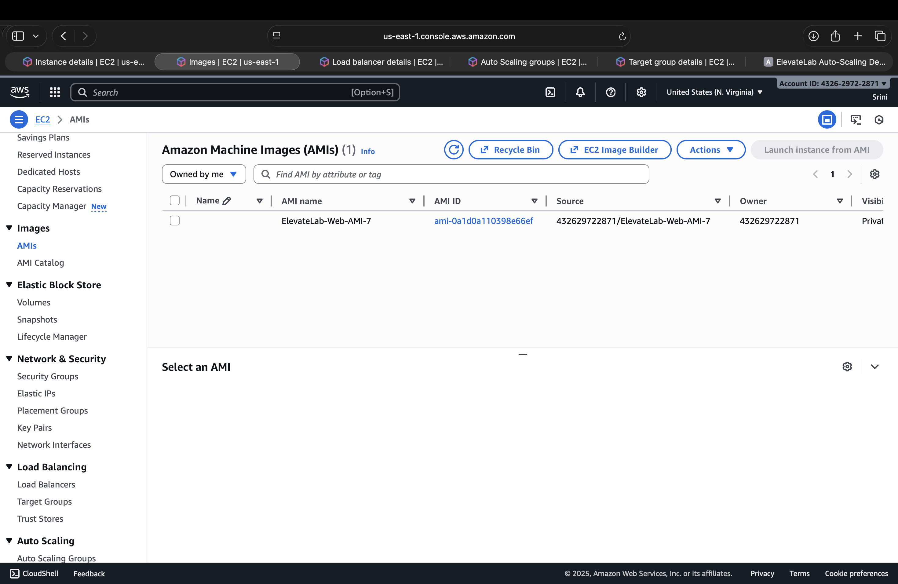

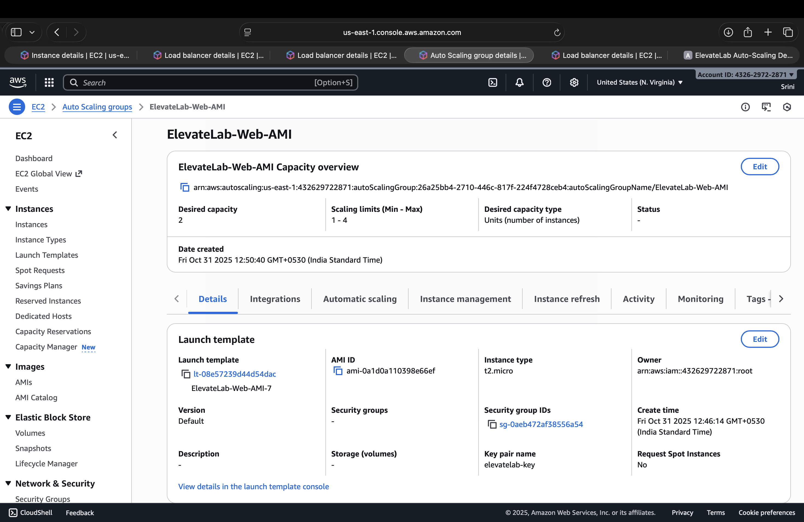

---

### **Step 4 - Launch Templates**

**Screenshot:**

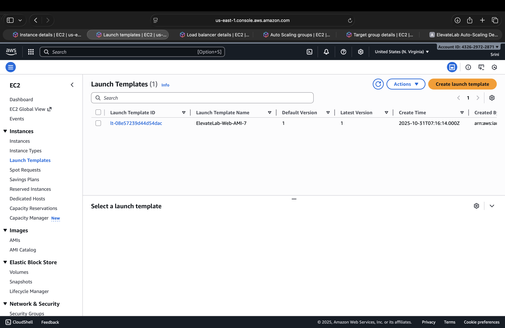

---

### **Step 5 - Create Application Load Balancer (ALB)**

1. Go to EC2 → Load Balancers → Create Load Balancer → Application Load Balancer
2. Name: ElevateLab-ALB
3. Scheme: Internet-facing
4. Listeners: HTTP, Port 80
5. Availability Zones: Select 2 subnets
6. Security Group: ElevateLab-ALB-SG
7. Routing: Choose target group ElevateLab-TG
8. Click Create Load Balancer
9. Wait for status → Active
  
**Screenshot**

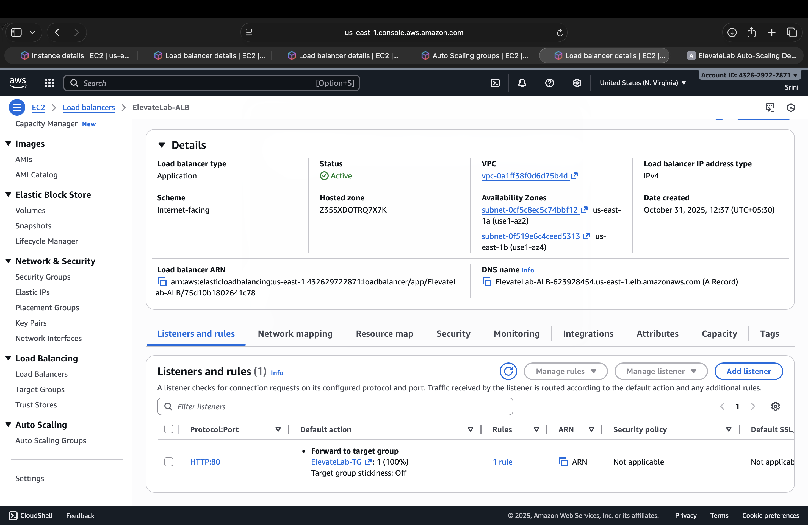


---

### **Step 6 - Register Instance to Target Group**

1. EC2 → Target Groups → Select ElevateLab-TG
2. Targets → Register Targets
3. Select the running instance and register
4. Wait until Health = Healthy

**Screenshot**

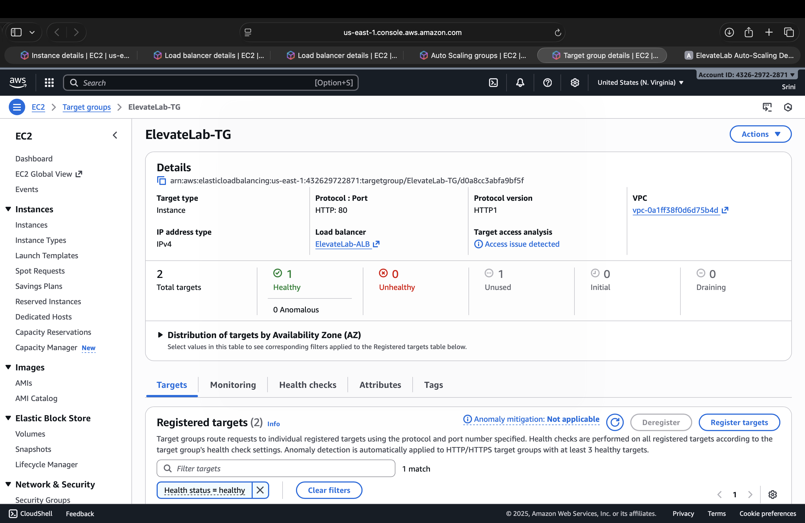

---

### **Step 7 — Create Auto Scaling Group (ASG)**

1. Go to EC2 → Auto Scaling Groups → Create Auto Scaling Group
2. Name: ElevateLab-ASG
3. Launch Template: Create new using AMI:
   AMI: ElevateLab-Web-AMI
   Instance type: t2.micro
   Security group: ElevateLab-Web-SG
4. VPC & Subnets: Select 2 subnets
5. Attach Load Balancer: Choose existing target group ElevateLab-TG
6. Desired capacity: 2
  Min: 1
  Max: 4 
7. Scaling Policy: Target tracking based on Average CPU Utilization = 60%
8. Click Create Auto Scaling Group

---

### **Step 8 - Test Load Balancer**

Open browser → **http://<ALB-DNS-NAME>**

You’ll see:
```
Welcome to ElevateLab Web Server
Served from instance: i-xxxxxxxxx
Public IP: 52.xx.xx.xx
Time: Fri Oct 31 06:51:08 UTC 2025
```

**Screenshot**

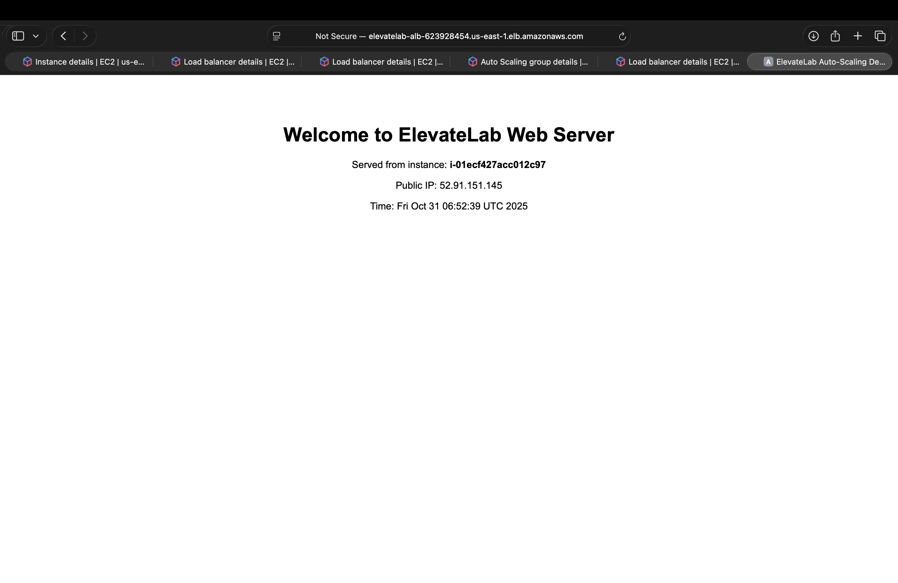
